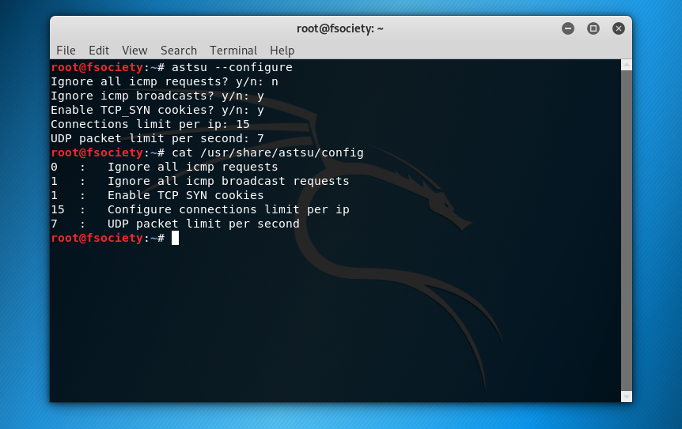

# astsu.sh - A firewall configuration tool

## What is astsu?
It is a tool that helps you to configure the firewall, to protect yourself from ddos attacks, like SYN flood, UDP flood, low band attacks, etc.

## Usage
First install the tool
```
chmod +x install.sh
./install.sh
```

To configure type 
``` 
astsu --configure 
``` 
And answer the questions, like:
[](screenshot.png)

To start and configure the firewall, type
```
astsu --start
```

If you want to return to the default, type
```
astsu --set-default
```

> ## If you find a bug, or want to add something to the tool, send a issue or a pull request.
